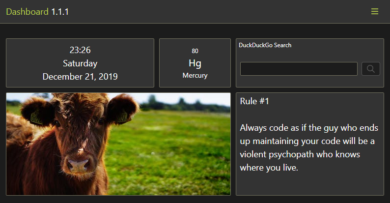

# Dashboard

 

## Goal

The goal of this project is a fully customizable and extendable dashboard/startpage, with modules like clock, weather, todo tasks, bookmarks, calendar, etc.

Usually, I wait for a MVP before releasing a project. This project is being developed in public from Day 1. I document my progress and (knowledge) insights in the [blog](https://dashboard.darekkay.com/docs/blog/), while the [changelog](https://dashboard.darekkay.com/docs/changelog/) describes the actual project features.

The current state of the project is available at [dashboard.darekkay.com](https://dashboard.darekkay.com).

For more information, view the [official documentation](https://dashboard.darekkay.com/docs/).

## Motivation

Why build yet another dashboard app?

Most popular apps are neither open-source nor customizable to a degree that I'd like it to be. On the other hand, most open-source projects seem to be outdated.

A new project is also a great opportunity to learn new concepts.

## Contribution

Contributions are always welcome, no matter how large or small. Before contributing, please read the [Code of Conduct](./CODE_OF_CONDUCT.md). When contributing to this repository, please first discuss the change you wish to make via [GitHub Issue](https://github.com/darekkay/dashboard/issues/new) or [email](mailto:hello@darekkay.com).

To get started with the project code, please read the [development documentation](https://dashboard.darekkay.com/docs/development/).

## License

This project and its contents are open source under the [MIT license](LICENSE).
