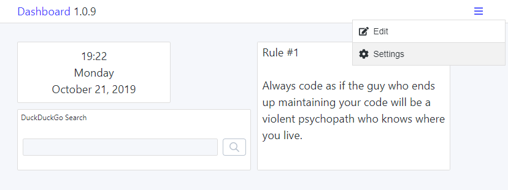

# Dashboard

 

## Goal

The goal of this project is a fully customizable and extendable dashboard/startpage, with modules like clock, weather, todo tasks, bookmarks, calendar, ... (see also my [ideas](#design-and-ideas))

Usually, I wait for a MVP before releasing a project. This project will be developed in public from Day 1. I document my progress and (knowledge) insights in the [journal](JOURNAL.md), while the [changelog](CHANGELOG.md) describes the actual project features.

The current state of the project is available at [dashboard.darekkay.com](https://dashboard.darekkay.com).

## Motivation

Why build yet another dashboard app?

Most popular apps (like [Momentum](https://momentumdash.com/)) are neither open-source nor customizable to a degree that I'd like it to be. On the other hand, most open-source projects seem to be outdated.

A new project is also a great opportunity to learn new concepts.

### Features

- [x] Themes support. Because noone will bat an eye without a Dark Mode™.
- [x] Multi-language support (English and German already provided).

### Implemented widgets

| type      | description           |
| --------- | --------------------- |
| text      | Notes field           |
| date-time | Current date and time |
| search    | Web search            |

The configuration options for each widget are listed [here](docs/widgets.md).

### Widget/integration ideas

- [ ] Current weather and forecast
- [ ] Bookmarks
- [ ] Calendar / next events
- [ ] Daily message (quote, image, tip)
- [ ] Todo tasks (integration with 3rd party, like Todoist, Wunderlist or GitHub Issues)
  ...

## Creating a new widget

1. Run the file generator to create a new widget (`yarn generate`).
2. Adjust the widget's `properties.ts` file with sane default values.
3. Re-scan the available widgets (`yarn scan-widgets`).
4. Define the required widget labels, like the name (visible in widget drawer) and headline (leave empty if no headline is required).

## Contribution

All contributors are highly welcome. If you want to collaborate on this project, just give me a [note](mailto:hello@darekkay.com).

View the [development documentation](docs/development.md) for more information.

## License

This project and its contents are open source under the [MIT license](LICENSE).
