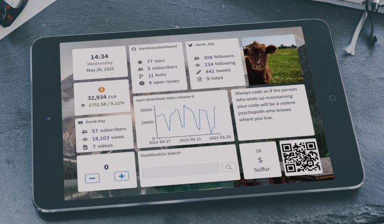

# Dashboard

## Project status

The project is under active development. While it is [live](https://dashboard.darekkay.com) already, I consider the status **late alpha** due to possible changes and the minimal amount of widgets.

## Goal

The goal of this project is a fully customizable and extendable dashboard, with modules like clock, weather, todo tasks, bookmarks, calendar, etc. The user should be able to view all important information on a single page.

- Create a browser start page with some common widgets.
- Display company-related information on TVs around the office.
- Display marketing information at an exhibition stand.
- Brainstorm ideas using notes and images.
- Monitor systems to ensure their availability and efficiency.
- Visualize your Internet of Things (IoT) devices.
- Create a [life engine](https://github.com/samsquire/ideas#5-life-engine).

Usually, I wait for a MVP before releasing a project. This project is being developed in public from Day 1. I document my progress and (knowledge) insights in the [blog](https://dashboard.darekkay.com/docs/blog/), while the [changelog](https://dashboard.darekkay.com/docs/changelog/) describes the actual project features.

The current state of the project is available at [dashboard.darekkay.com](https://dashboard.darekkay.com).

## Motivation

Why build yet another dashboard app?

Most popular apps are neither open-source nor customizable to a degree I'd like it to be. Additionally, most open-source projects seem to be outdated.

A new project is also a great opportunity to learn new concepts.

## Features

- ☑ 15 [widgets](widgets/README.md) as of May 2021.
- ☑ Themes support. Because no one will bat an eye without a Dark Mode™.
- ☑ Multi-language support (English, German and French already provided).

## Contribution

Contributions are always welcome, no matter how large or small. Before contributing, please read the [Code of Conduct](https://github.com/darekkay/dashboard/blob/master/CODE_OF_CONDUCT.md). When contributing to this repository, please first discuss the change you wish to make via [GitHub Issue](https://github.com/darekkay/dashboard/issues/new) or join our community chat on [Gitter](https://gitter.im/darekkay-dashboard/community).

To get started with the project code, please read the [development documentation](development/README.md).

## License

This project and its contents are open source under the MIT license.
