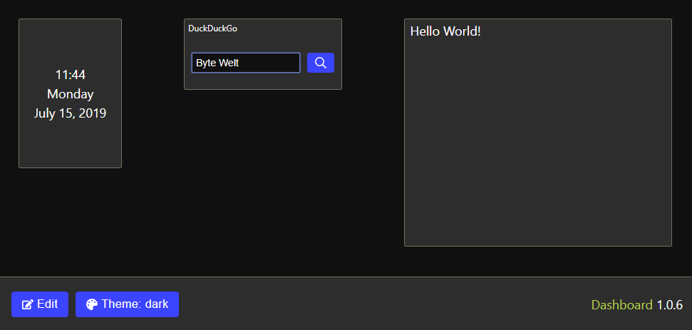

# 2019-07-15 (1.0.6)

The first step for GUI-based dashboard customization is done: the widgets are now draggable/resizeable. The widget selection is still fixed, though, so I should implement a widget drawer soon.

I've also added a new Search widget. Right now the DuckDuckGo search engine is hard-coded, but in the future there will be a list of pre-defined providers and the possibility to define a custom website.

Finally, I've replaced most of my (S)CSS files with a Functional CSS approach. I've used [Tailwind CSS](https://tailwindcss.com/), one of the most popular utility-first CSS frameworks. I really enjoy it so far :)

Notice: The state data is stored in the Local Storage, so you might have to clear it if you have opened the website in the past. This won't be necessary when the project is out of the work-in-progress state of course.

