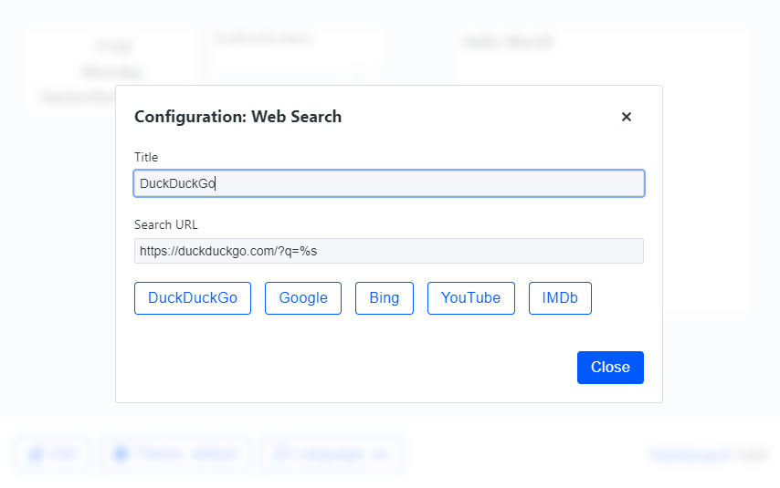

# 2019-09-30 (1.0.9)

The personalization concept is fully implemented: every widget can now define a configuration modal. The first (and currently only) widget is the Search widget, where the user is able to define the title and URL pattern. A list of predefined search engines is also available for a quicker access.

When the widgets are initially loaded, a loading spinner was being shown before. I have replaced this loading indicator with skeleton loading for a nicer look.

Now I can concentrate on implementing more widgets to make this project actually useful.

