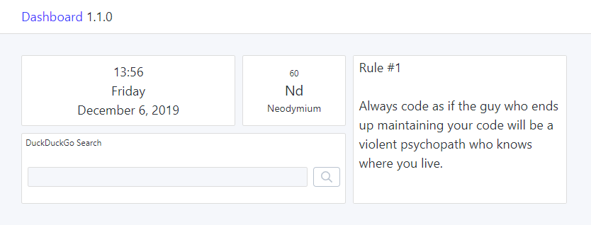

# 2019-12-05 (1.1.0)

## Support for remote data

So far, all widgets were fully local, i.e., they did not require any remote data. This makes the possibilities rather limited. I have finally designed the architecture to support fetching remote data, and I have implemented the first widget as an example: Chemical Element of the Day. This widget displays the data from my [Tip of the Day](https://tips.darekkay.com/) project. Other TotD widgets will join the list in the future.

I had to revisit some architectural decisions. First, I have replaced `redux-observable` with [redux-saga](https://github.com/redux-saga/redux-saga). I was hoping to gain some more experience with RxJS (which I did), but it felt too complicated to implement the easiest fetch/success/error flow. I find the procedural way of redux-saga more natural and easier to understand.

Second, I have removed the shared state completely. It was meant as a performance optimization for widgets with shared data, like the new Chemical Elements widget. The drawback was having to handle the state at different places, making the implementation more complicated than necessary. Instead, now every widget has its own (sub-)state. I might implement some request-level caching in the future to prevent fetching the same resource twice.

## Other changes

All input fields contain an "X" button to clear the content. It was tricky to get the rendering and focus right, but it looks good now.

I've added a [Code of Conduct](https://github.com/darekkay/dashboard/blob/master/CODE_OF_CONDUCT.md) to the project. While there are no contributions yet, it's important to create a welcoming and inclusive atmosphere from the beginning.

JetBrains released the [Grazie Plugin](https://plugins.jetbrains.com/plugin/12175-grazie/), and advanced spelling/grammar/styling checker, for all of their IDEs. I have enabled this plugin for Markdown files, and it helped me to solve some minor issues.
