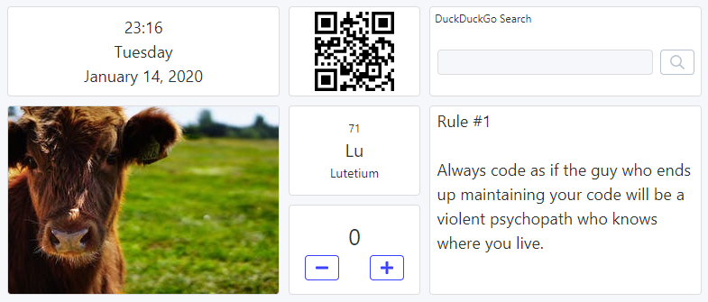
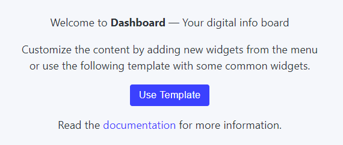

# 2020-01-14 (1.1.3)

The last few days were crazy 🤩

I got accepted at a [Usability Testessen](https://usability-testessen.org/) ("usability test dinner") event to present this project and let other people test it. This meant: a lot of cleaning up and polishing. 🧹

First, there are two new widgets: [QR Code](https://dashboard.darekkay.com/docs/widgets/qr-code.html) and [Counter](https://dashboard.darekkay.com/docs/widgets/counter.html). I wanted to do some dogfooding with the QR widget, i.e., use a second laptop at the event to display a QR code leading to the Dashboard website. In the end I just printed the QR code on a sheet of paper 😅

I've spent some time improving the user experience. There is a new welcome page when the Dashboard is being used for the first time (or rather when there are no widgets configured). A demo/template is still available, if the user chooses to use one. The widgets now show an icon if some configuration is required (e.g. a missing image URL). I've even improved the "JavaScript required" page for all the privacy-conscious people out there.

Finally, I've fixed some small bugs (broken widget drawer on mobile, selected language not persisted on page reload), and implemented a big performance improvement (widgets are not re-mounted each time the layout changes anymore).

I'm really excited and looking forward to getting some valuable feedback from other people. Tomorrow's the day. 😊
