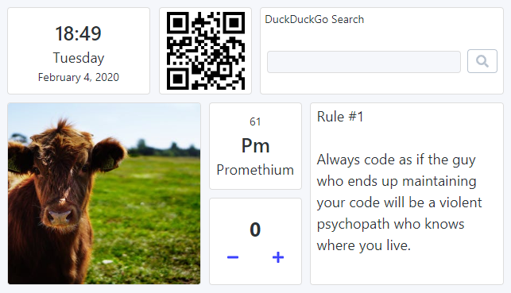

# 2020-02-04 (1.1.4)

## Usability Dinner

As mentioned in my [previous post](./2020-01-14.md), I have been working hard to polish this project for the [Usability Testessen](https://usability-testessen.org/). This event also forced me to concentrate more on the marketing part, i.e., creating a pitch and rethinking the target groups / use cases.

In 6 testing sessions (12 minutes each), 11 people gave me **lots** of feedback and ideas. Some issues were obvious, and I already knew I have to fix them (e.g. not being able to configure a widget in "edit" mode). Some issues I didn't realize (e.g. "How do I move a widget?"). And some ideas I didn't even consider until now (e.g. a dashboard background image).

The overall excitement for my Dashboard project wasn't overwhelming (maybe because I was the only non-startup at the event). However, one feature _everyone_ loved was the Dark Mode. Don't ever underestimate this.

## Project update

The UI design is rather pragmatic so far. I want it to stay minimalistic, but it doesn't have to look so boring. I've started applying some principles from [Refactoring UI](https://refactoringui.com/) by introducing different font sizes and font weights. This alone makes the Date&Time and Chemical Elements widgets look so much better.

The widget drawer needs a major UI/UX redesign. The first step was to group all widgets by category.

This release contains some small bug fixes and improvements as well. One interesting thing I have learned is the [inconsistent button behavior among browsers](https://zellwk.com/blog/inconsistent-button-behavior/). This affected the Input clear button on macOS, which is now fixed.

Finally, I've increased the number of columns from 12 to 24 and adjusted the row height to provide a more precise widget sizing.

There was one more idea I've played with but abandoned for now: fluid typography. Currently, the font sizes are pretty much fixed. The user has to resize the widget to a size where all the content will fit into. I thought it would be nice to have the content match the widget size instead. However, there are some issues with this idea:

- There is no native CSS way to achieve this. The best workaround I have found was to use `transform: scale()` (cross-browser version for `zoom` so to say). But it's fragile and requires some pixel-perfect adjustments.
- Some widgets shouldn't scale with the widget size (e.g. notes, website). One could turn off the scaling for selected widgets, but then the look&feel wouldn't be as consistent anymore.
- The overall motivation for this idea is to enable the user to see a larger version of some widgets. That is already possible by using the browser zoom feature. I should probably improve the UX by adding some buttons to control the zoom level.
