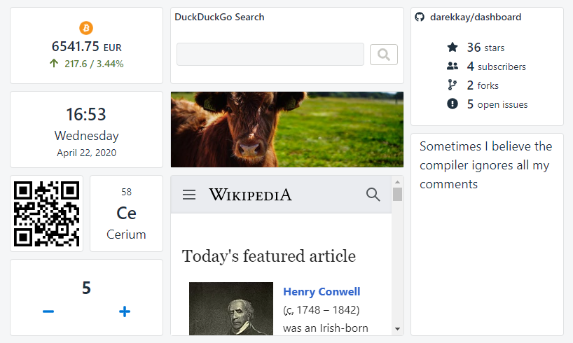

# 2020-04-22 (1.3.0)

## New widget: GitHub Stats

There's a new widget for displaying GitHub stats for a user or a repository 🎉.

The main work happened on the backend side. Setting up a unit test infrastructure with jest and [supertest](https://github.com/visionmedia/supertest) was more difficult than expected, mainly getting the axios/cachios mocking right. But it was worth it: Test Driven Development saved me twice already 😊.

## Fullscreen feature

When viewing a dashboard on a dedicated screen, one usually doesn't want to see the browser UI around it. It was the first time I've learned about the [Fullscreen API](https://developer.mozilla.org/en-US/docs/Web/API/Fullscreen_API). Previously, I thought there was a JavaScript function to just trigger the F11 native browser fullscreen mode. But the API is more powerful than that - it can put any DOM mode in fullscreen. It still has some quirks, but [react-full-screen](https://www.npmjs.com/package/react-full-screen) abstracts everything away and JustWorks™.

## Contributing

This project got the first contribution: a French translation, provided by ([@faboo03](https://github.com/faboo03))! Merci beaucoup 😀.

To encourage more people to contribute, I've improved the documentation (incl. a rough [roadmap](https://dashboard.darekkay.com/docs/roadmap/)), created a [Gitter channel](https://gitter.im/darekkay-dashboard/community) for communication and started moving some tasks from my personal TODO list into [Github Issues](https://github.com/darekkay/dashboard/issues). I'm happy to see this project moving forward!

## Request caching

While the Coingecko API is very generous (100 requests/min with no registration), this project shouldn't abuse it. An obvious optimization is caching external requests on the server side.

I am using [axios](https://github.com/axios/axios), a popular HTTP client library, so it wasn't surprising to find multiple caching modules:

- [axios-extensions](https://github.com/kuitos/axios-extensions)
- [axios-cache-adapter](https://github.com/RasCarlito/axios-cache-adapter)
- [cachios](https://github.com/AlbinoDrought/cachios)

While evaluating I've created a list of requirements:

- Cache TTL (time to live) must be configurable per request (because of different update cycles per widget type).
- Parametrized caching (i.e., `/moo?v=1` and `/moo?v=2` should be cached separately).
- In-memory cache is sufficient for now, but using a scalable alternative should be technically possible.
- Store only relevant data instead of the whole axios response.
- Logging (to verify the functionality and debugging).
- TypeScript support.

No library fulfills all requirements, but `cachios` comes close. It doesn't provide logging, but it's possible to use axios interceptors to log the actual requests being sent. If the interceptor doesn't fire, the response is coming from the cache. Cachios also doesn't come with TypeScript support, but creating a custom definition file (at least for my use cases) wasn't difficult.

So here we are: now the API will only be called once per currency/cryptocurrency pair every 15 minutes.

In the future I might add client-side caching (i.e. caching _internal_ API requests), too, but for now it's not necessary.

## Other changes

A lot of small improvements happened under the hood. View the [full changelog](https://dashboard.darekkay.com/docs/changelog).
