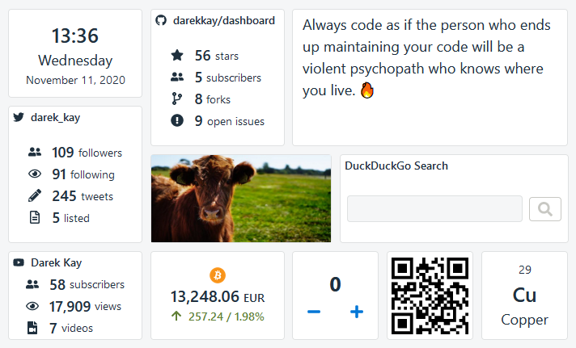

# 2021-01-10 (1.4.0)

It has been some time since the last release. Dashboard became my on-off project, as I've been working on some of my [other ideas](https://darekkay.com/projects/), like [evaluatory](https://darekkay.com/evaluatory/).

One of the best things was to have some [new contributors](https://github.com/darekkay/dashboard#contributors). With their help, Dashboard now includes some new widgets:

- Country of the Day: Display information about world countries (from the [Tip of the Day](https://tips.darekkay.com/html/countries-en.html) project.
- Twitter Stats: Display various Twitter user stats.
- YouTube Stats: Display various Youtube channel stats.
- Random Image: Display a random image. Changes daily.

View the [full changelog](https://dashboard.darekkay.com/docs/changelog) to see all the awesome changes.
