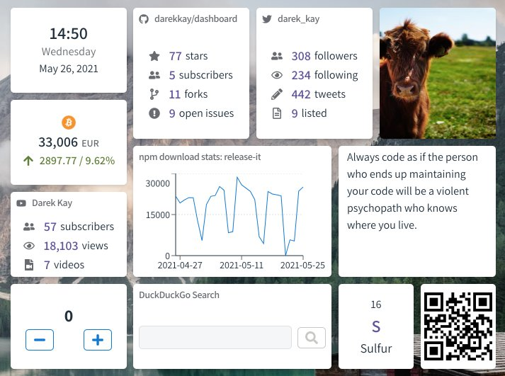
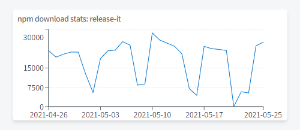

# 2021-05-26 (1.5.0)

## Design update

Previously, the dashboard looked cluttered and unbalanced:

I've adjusted the font sizes, included more colors and added some space. There's also a new web font. I've once been an advocate for the system font stack, i.e., using native instead of web fonts. But after introducing the Nunito font to my blog [this year](https://darekkay.com/blog/hexo-to-eleventy/#font), I've decided to also give the Dashboard more personality. I've chosen Assistant, a sans-serif font that comes with the right level of "condensation".

I'm not a designer, but the UI looks now more harmonized.

## Background image

Adding a custom background image wasn't high on my priority list. But since I've implemented this four months ago, I don't want to miss it again. You can specify the URL to any image you like, but I've handpicked five example images: `/backgrounds/bg-01.jpg` through `/backgrounds/bg-05.jpg`. I might provide a better UI to pick one of the example images in the future.

## New widget: Chart / Graph

There's a new widget for displaying [line charts/graphs](https://dashboard.darekkay.com/docs/widgets/chart.html). The best thing is the flexibility. You can specify a URL to any JSON document and define custom JSON paths for the data to be displayed. I've built this widget to display my daily server access numbers, but you can use it for pretty much anything.

## Widget enhancements

My team is working in different timezones, so I find it useful to know the local time of my colleagues. You can now configure a timezone within the **Date & Time** widget alongside a custom headline.

Furthermore, the **Cryptocurrencies** widget now includes Nano and Dogecoin. 🚀

## Type-safe API

This is one of the "under the hood" topics, but I like it a lot. I'm now using [tsoa](https://github.com/lukeautry/tsoa) to simplify the creation of backend routes. Tsoa provides an abstraction over Express and handles boilerplate code for things like request validation. It also lets you create a Swagger/OpenAPI file. With [swagger-typescript-api](https://github.com/acacode/swagger-typescript-api), I can then automatically create a type-safe frontend API. Sounds like a lot of tooling, but now there's no more guessing/looking up what my services expect and return. I've started writing a separate post on my [blog](https://darekkay.com/) with more details.

## Next steps

Dashboard remains my toy project: I can try out patterns, libraries and tools and create something useful as a byproduct. I don't have any specific timeline for this project, but there are two things I'd like to handle next:

- [Redesign the widget drawer](https://dashboard.darekkay.com/docs/roadmap/#features-and-improvements). Depending on the screen resolution, the bottom widgets are rendered outside the drawer. I didn't invest much time to fix it, as I've planned to redesign the whole thing anyway.
- Create a weather widget. I have already finished the backend service a few months ago, but I've procrastinated with the frontend part. 

View the [full changelog](https://dashboard.darekkay.com/docs/changelog) to see all the awesome changes.
